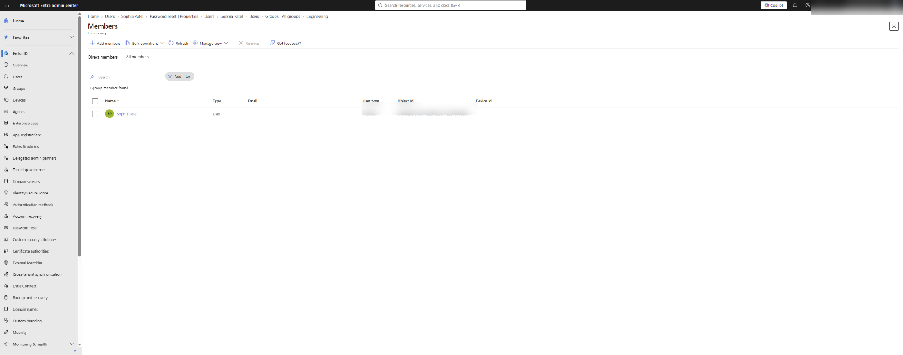
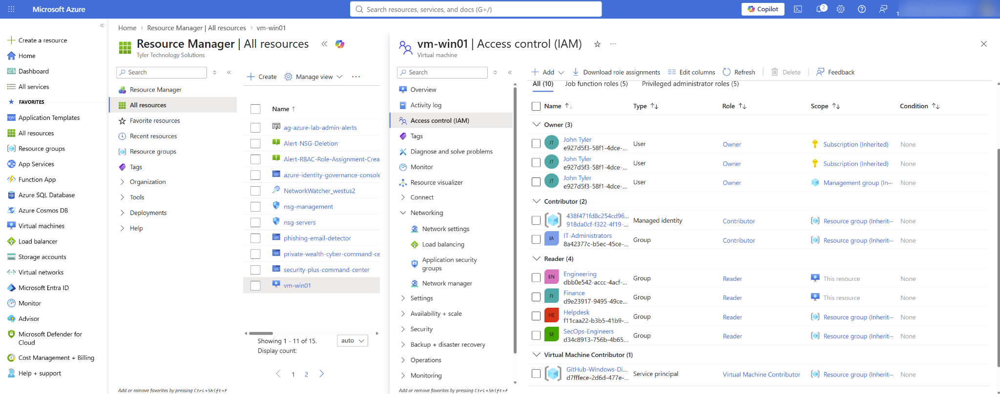
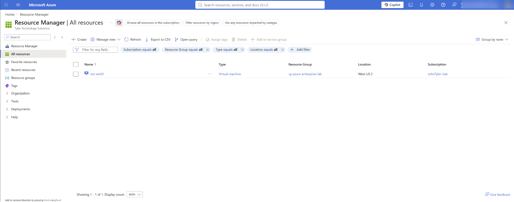
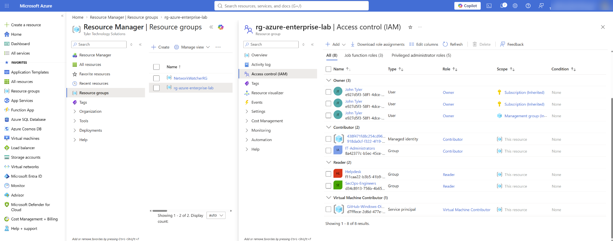

# Azure MFA & RBAC Lifecycle Administration

Hands-on Microsoft Entra ID and Azure RBAC lab demonstrating **identity authentication, MFA enrollment, group-based authorization, least-privilege access, end-user validation, and access revocation**.

## Overview

This lab simulates a common enterprise IAM workflow: an administrator provisions a user, places the user in the appropriate security group, enforces strong authentication, grants access through the group instead of directly to the individual, validates the effective permissions from the user's perspective, and then removes the authorization to verify that access is revoked.

The test identity used in this lab is **Sophia Patel**, a member of the **Engineering** security group in my Microsoft Entra ID lab tenant.

## What I Implemented

### 1. Microsoft Entra ID user and group administration
- Managed a cloud-only Microsoft Entra ID user account for Sophia Patel.
- Confirmed Sophia's membership in the **Engineering** security group.
- Used group-based access rather than assigning permissions directly to the individual user.

### 2. MFA registration and authentication
- Signed in as the test user.
- Registered **Microsoft Authenticator** as an authentication method.
- Successfully completed the authentication setup and verified that the account could sign in.

### 3. Group-based Azure RBAC
- Assigned the **Engineering** security group the Azure **Reader** role for the Windows virtual machine `vm-win01`.
- Scoped the role assignment to the specific resource instead of granting broader permissions than necessary.
- Used Azure RBAC inheritance/effective permissions to give Sophia access through her group membership.

### 4. End-user access validation
- Signed into Azure as Sophia Patel after authentication was configured.
- Confirmed that the account could see the authorized Windows VM.
- Verified that the user did not receive unnecessary access to the rest of the Azure environment.

### 5. Access revocation
- Removed the Engineering group's role assignment after testing.
- Signed back into the test account and verified that the previously authorized access was removed.
- This validated both the **provisioning and deprovisioning** sides of the access lifecycle.

## Lab Flow

```text
Entra ID User
    |
    v
Engineering Security Group
    |
    v
Microsoft Authenticator / MFA
    |
    v
Azure RBAC: Reader
    |
    v
Scoped Resource: vm-win01
    |
    v
User Access Validation
    |
    v
Role Assignment Revoked
    |
    v
Access Removed / Verified
```

## Screenshots

> The screenshots are public-safe copies with unnecessary account identifiers redacted.

### Authenticator registration


Microsoft Authenticator successfully registered for the Sophia Patel lab identity.

### Engineering group membership


Sophia shown as a direct member of the Engineering security group.

### Engineering Reader role on the Windows VM


The Engineering group is assigned **Reader** at the `vm-win01` resource scope, demonstrating least-privilege, group-based access.

### End-user verification


Signed in as Sophia, the Azure portal shows the Windows VM she was authorized to read, rather than broad administrative access.

### Resource-group IAM context


IAM view showing the broader role-assignment context in the lab environment.

## Security Principles Demonstrated

- **Least privilege** — access was scoped to the resource required for the test.
- **Group-based authorization** — permissions were assigned to a security group rather than directly to the user.
- **Strong authentication** — Microsoft Authenticator was configured for the test identity.
- **Separation of identity and authorization** — authentication proved who the user was; Azure RBAC controlled what the user could access.
- **Provisioning and deprovisioning** — access was granted, tested, revoked, and tested again.
- **Effective-permission validation** — access was verified while actually signed in as the affected user instead of assuming the role assignment worked.

## Organizational Value

This workflow maps directly to real IAM and cloud-administration responsibilities.

I can help an organization:

- Provision and maintain Microsoft Entra ID users and security groups.
- Support MFA enrollment and authentication troubleshooting.
- Implement scalable group-based access instead of relying on one-off user permissions.
- Apply Azure RBAC at the correct scope to reduce excessive privileges.
- Validate access from the end-user perspective.
- Remove access when a role, project, or employment relationship changes.
- Troubleshoot authorization issues by separating identity, group membership, RBAC scope, and effective permissions.
- Document repeatable onboarding, access-change, and offboarding procedures.

## Skills Demonstrated

**Microsoft Entra ID · Azure RBAC · IAM · MFA · Microsoft Authenticator · Security Groups · Least Privilege · Access Provisioning · Access Revocation · Azure Virtual Machines · Cloud Security · Identity Lifecycle Administration**

## Production Considerations

In a production environment, I would extend this design with controls such as:

- Conditional Access policies
- Privileged Identity Management (PIM) for privileged roles
- Periodic access reviews
- Centralized sign-in and audit-log monitoring
- Formal approval/change-management workflows
- Break-glass/emergency access accounts
- Role-assignment monitoring and alerting

Those controls would complement the group-based RBAC and MFA foundation demonstrated in this lab.

---

**Author:** John Tyler  
**Focus:** Systems Administration · Identity & Access Management · Azure · Cybersecurity
